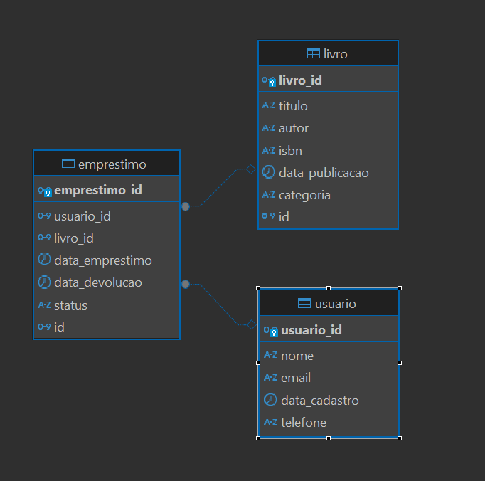

# API de gestão de biblioteca

- Autor: Mauro Cesar Yaga Junior
- Data: 2024-08-28
- Versão: 1.0.0

---

## Sumário

- [Descrição](#descrição)
- [Tecnologias](#tecnologias)
- [Dependências](#dependências)
- [Instruções](#instruções)
- [Documentação](#documentação)
- [Abordagem](#abordagem)
- [Disclaimers](#disclaimers)

---

## Descrição

Este projeto é uma API de gestão de biblioteca desenvolvida em Java com o framework Spring Boot. 
A API permite a manipulação de livros, usuários e empréstimos em um banco de dados relacional.  
Os usuários podem realizar operações de CRUD (Criar, Ler, Atualizar e Deletar) para cada uma das entidades.
O objetivo de desenvolvimento desta API atender os requisitos de um desafio de desenvolvimento back-end. 

---

## Tecnologias

- Java: Linguagem de programação usada para desenvolver a aplicação.
- Spring Boot: Framework para facilitar o desenvolvimento de aplicações Java.
- Maven: Ferramenta de automação de compilação e gerenciamento de dependências.
- SQL: Linguagem de consulta para manipulação de dados no banco de dados.
- Swagger: Ferramenta para documentação automática da API.
- Docker (implícito): Plataforma para contêinerização do banco de dados.
- PostgreSQL (implícito): Sistema de gerenciamento de banco de dados relacional.

---

## Dependências

A API de gestão de biblioteca foi desenvolvida com as seguintes dependências:

- Spring Boot Starter Data JPA: Facilita a criação de aplicações Spring que usam a tecnologia de acesso a dados JPA.
- Spring Boot Starter Web: Facilita a criação de aplicações web, incluindo APIs RESTful, usando o Spring MVC.
- PostgreSQL JDBC Driver: Driver JDBC para conectar ao banco de dados PostgreSQL.
- Lombok: Biblioteca Java que ajuda a reduzir a verbosidade do código.
- Spring Boot Starter Test: Starter para testar aplicações Spring Boot.
- SpringDoc OpenAPI UI: Facilita a geração de documentação da API OpenAPI 3.0.

---

## Instruções

**Requisitos para rodar a aplicação:**
 - java 17 ou superior
 - jdk
 - maven 
 - docker 
 - docker-compose
 - IDE de sua preferência
 - SGBD 

Para testar esta API de gestão de biblioteca, siga os passos abaixo:

**clone o repositório:**

```bash
git clone https://github.com/mauroyaga/sring-boot-api-rest-gestao-biblioteca.git
```
O próximo passo é subir uma imagem docker com um servidor PostgreSQL. Para isso é necessario ter o Docker instalado na sua máquina.
Em alguns casos, é necessario iniciar o serviço do Docker em background.
Com a API clonada e aberta na sua IDE de preferência, execute o comando para rodar o banco de dados em um container Docker:

```bash
docker-compose up -d
```

Após o banco de dados estar rodando, execute a aplicação.
A API ira criar automaticamente as tabelas no banco de dados, através do arquivo init.sql com om docker-compose.
Você pode acessar o banco de dados no seu SGBD de preferência com as seguintes credenciais:

- **Usuário:** postgres
- **Senha:** 123
- **Porta:** 5432
- **Nome do banco de dados:** gestao-biblioteca
- **Serer Host:** localhost

**Acesse a documentação da API no Swagger:**

Com a API rodando, você pode acessar a documentação da API no Swagger, através do link:

`http://localhost:8081/swagger-ui.html`

---

## Documentação

**Requisitos do projeto:**

    - A API permiti o CRUD de livros, usuários e empréstimos.
    - A API permiti a persistência dos dados em um banco de dados relacional.
    - A API possui documentação automática no Swagger, por onde é possível testar os endpoints.

**Modelagem do Banco de Dados**

- Tabela: usuario
    - usiario_id: INTEGER
    - nome: VARCHAR
    - email: VARCHAR
    - data_cadastro: DATE
    - telefone: VARCHAR

- Tabela: livro
    - livro_id: INTEGER
    - titulo: VARCHAR
    - autor: VARCHAR
    - isbn: VARCHAR
    - data_publicacao: DATE
    - categoria: VARCHAR
  
- Tabela: emprestimo
    - emprestimo_id: INTEGER
    - usuario_id: INTEGER
    - livro_id: INTEGER
    - data_emprestimo: DATE
    - data_devolucao: DATE
    - status: VARCHAR

**Relacionamentos**

As relações entre as entidades são:

- Emprestimo para Usuario: 1 para N
- Emprestimo para Livro: 1 para N

**Diagrama entidade-relacionamento**


  
---

## Abordagem

---


## Disclaimers

...