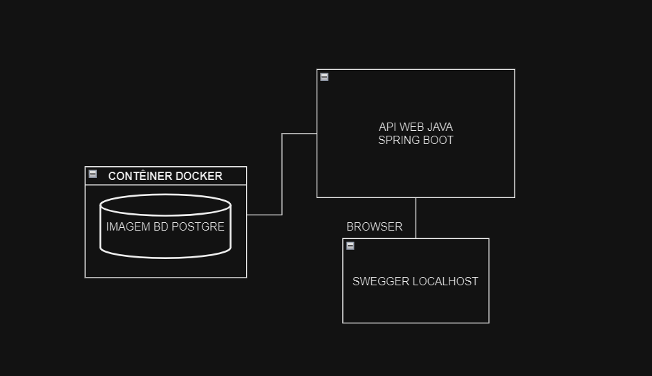
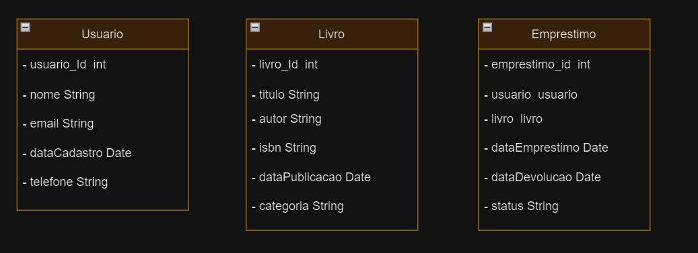

# API REST Gestão de Biblioteca


Este projeto conciste em uma API Java com Sping Boot para gestão de blioteca. Foi desenvolvido a mérito de estudos, com base em um desafio técnico. Ainda tem diversos pontos a ser aprimorado
mas pode contribuir para o conhecimento deste tipo de tecnologia.

---

## Sumário

<<<<<<< HEAD
=======
- [API REST Gestão de Biblioteca](#api-rest-gestão-de-biblioteca)
>>>>>>> a76aad898c0382d42cde31fcaf4b0258c8307eea
- [Descrição](#descrição)
- [Tecnologias](#tecnologias)
- [Dependências](#dependências)
- [Instruções](#instruções)
<<<<<<< HEAD
- [Documentação](#documentação)
- [Abordagem](#abordagem)
- [Disclaimers](#disclaimers)
=======
  - [Requisitos para rodar a aplicação](#requisitos-para-rodar-a-aplicação)
  - [Testando a API](#testando-a-api)
  - [Acesse o Banco pelo SGBD](#acesse-o-banco-pelo-sgbd)
  - [Acesse a documentação da API no Swagger](#acesse-a-documentação-da-api-no-swagger)
- [Endpoints](#endpoints)
  - [Usuario](#usuario)
  - [Livro](#livro)
  - [Emprestimo](#emprestimo)
- [Documentação](#documentação)
  - [Requisitos do projeto](#requisitos-do-projeto)
  - [Modelagem do Banco de Dados](#modelagem-do-banco-de-dados)
  - [Relacionamentos](#relacionamentos)
  - [Diagrama entidade-relacionamento](#diagrama-entidade-relacionamento)
- [Abordagem](#abordagem)
- [Limitações e Problemas do Projeto](#limitações-e-problemas-do-projeto)
>>>>>>> a76aad898c0382d42cde31fcaf4b0258c8307eea

---

## Descrição

Este projeto é uma API de gestão de biblioteca desenvolvida em Java com o framework Spring Boot. 
A API permite a manipulação de livros, usuários e empréstimos em um banco de dados relacional.  
Os usuários podem realizar operações de CRUD (Criar, Ler, Atualizar e Deletar) para cada uma das entidades.
O objetivo de desenvolvimento desta API atender os requisitos de um desafio de desenvolvimento back-end. 

---

 ## Tecnologias

- Java: Linguagem de programação usada para desenvolver a aplicação.
- Spring Boot: Framework para facilitar o desenvolvimento de aplicações Java.
- Maven: Ferramenta de automação de compilação e gerenciamento de dependências.
- SQL: Linguagem de consulta para manipulação de dados no banco de dados.
- Swagger: Ferramenta para documentação automática da API.
- Docker: Plataforma para contêinerização do banco de dados.
- PostgreSQL: Sistema de gerenciamento de banco de dados relacional.

---

## Dependências

A API de gestão de biblioteca foi desenvolvida com as seguintes dependências:

- Spring Boot Starter Data JPA: Facilita a criação de aplicações Spring que usam a tecnologia de acesso a dados JPA.
- Spring Boot Starter Web: Facilita a criação de aplicações web, incluindo APIs RESTful, usando o Spring MVC.
- PostgreSQL JDBC Driver: Driver JDBC para conectar ao banco de dados PostgreSQL.
- Lombok: Biblioteca Java que ajuda a reduzir a verbosidade do código.
- Spring Boot Starter Test: Starter para testar aplicações Spring Boot.
- SpringDoc OpenAPI UI: Facilita a geração de documentação da API OpenAPI 3.0.

---

## Instruções

<<<<<<< HEAD
**Requisitos para rodar a aplicação:**
=======
### Requisitos para rodar a aplicação:
>>>>>>> a76aad898c0382d42cde31fcaf4b0258c8307eea
 - java 17 ou superior
 - jdk
 - Maven 
 - Docker 
 - Docker-compose
 - IDE 
 - SGBD

  ---
  
### Testando a API

**clone o repositório:**

```bash
git clone https://github.com/mauroyaga/sring-boot-api-rest-gestao-biblioteca.git
```
O próximo passo é subir uma imagem docker com um servidor PostgreSQL. Para isso é necessario ter o Docker instalado na sua máquina.
Em alguns casos, é necessario iniciar o serviço do Docker em background.

Com o arquivo clonado, descompactado e aberto na sua IDE de preferência, no terminal, execute o comando para rodar o banco de dados em um container Docker:

```bash
docker-compose up -d
```
Se todas as dependências e requisitos necessários estiverem devidamente configurados e disponíveis, seu banco de dados estará rodando em um contêiner docker.
A API irá criar automaticamente as tabelas no banco de dados, através do arquivo init.sql contido no diretório ***docker-entrypoint-initdb.d*** que contém o sql das tabelas.
Tudo isso configurado pelo ***docker-compose.yaml***.


Você pode verificar se o conteiner está rodando com o comando:

```bash
docker ps
```

---

### Acesse o Banco pelo SGBD

Você pode acessar o banco de dados no seu SGBD de preferência com as seguintes credênciais:

- **Usuário:** postgres
- **Senha:** 123
- **Porta:** 5432
- **Nome do banco de dados:** gestao-biblioteca
- **Server Host:** localhost


---

  
## Acesse a documentação da API no Swagger

Com a API rodando, você pode acessar a documentação da API no Swagger, através do link:

[http://localhost:8081/swagger-ui.html](http://localhost:8081/swagger-ui.html)

Lá você tera acesso a um interface visual para os endpoints da APi e podera fazer as requisições para testar a aplicação.


--- 

## Endpoints

### Usuario

**1. Listar todos os usuários**
   
- Endpoint: /usuarios
- Método HTTP: GET
- Resposta: Uma lista de usuários.
  
 Exemplo de resposta:

 ```bash
[
    {
        "usuario_id": 1,
        "nome": "João",
        "email": "joao@gmail.com",
        "data_cadastro": "2022-01-01",
        "telefone": "11999999999"
    },
    {
        "usuario_id": 2,
        "nome": "Maria",
        "email": "maria@gmail.com",
        "data_cadastro": "2022-01-02",
        "telefone": "11988888888"
    }
]
```

**2. Obter um usuário por ID**
   
- Endpoint: /usuarios/{id}
- Método HTTP: GET
- Resposta: O usuário com o ID especificado.
  
  Exemplo de resposta:

 ```bash
{
    "usuario_id": 1,
    "nome": "João",
    "email": "joao@gmail.com",
    "data_cadastro": "2022-01-01",
    "telefone": "11999999999"
}   
```

**3. Criar um novo usuário**
   
- Endpoint: /usuarios
- Método HTTP: POST
- Corpo da requisição: Um objeto JSON representando o novo usuário.
  
Exemplo de corpo da requisição:

```bash
{
    "nome": "João",
    "email": "joao@gmail.com",
    "telefone": "11999999999"
}
```

**4. Atualizar um usuário**

- Endpoint: /usuarios/{id}
- Método HTTP: PUT
- Corpo da requisição: Um objeto JSON com os campos que você deseja atualizar.

Exemplo de corpo da requisição:

```bash
{
    "nome": "João",
    "email": "joao_novo@gmail.com",
    "telefone": "11999999999"
}
```

**5. Deletar um usuário**
   
- Endpoint: /usuarios/{id}
- Método HTTP: DELETE
- Resposta: Sem corpo de resposta. O status HTTP 204 (No Content) indica que o usuário foi deletado com sucesso.
  
Substitua {id} pelo ID do usuário que deseja deletar.

---

### Livro

**1. Listar todos os livros**
   
- Endpoint: /livros
- Método HTTP: GET
- Resposta: Uma lista de livros.
  
  Exemplo de resposta:

  ```bash
  [
    {
        "livro_id": 1,
        "titulo": "O Senhor dos Anéis",
        "autor": "J.R.R. Tolkien",
        "isbn": "9788533613379",
        "data_publicacao": "1954-07-29",
        "categoria": "Fantasia"
    },
    {
        "livro_id": 2,
        "titulo": "1984",
        "autor": "George Orwell",
        "isbn": "9788535914849",
        "data_publicacao": "1949-06-08",
        "categoria": "Ficção Científica"
    }
  ]
  ```

**2. Obter um livro por ID**
   
- Endpoint: /livros/{id}
- Método HTTP: GET
- Resposta: O livro com o ID especificado.

   Exemplo de resposta:

  ```bash
  {
    "livro_id": 1,
    "titulo": "O Senhor dos Anéis",
    "autor": "J.R.R. Tolkien",
    "isbn": "9788533613379",
    "data_publicacao": "1954-07-29",
    "categoria": "Fantasia"
  }
  ```
  
**3. Criar um novo livro**
   
- Endpoint: /livros
- Método HTTP: POST
- Corpo da requisição: Um objeto JSON representando o novo livro.

Exemplo de corpo da requisição:

```bash
{
    "titulo": "O Senhor dos Anéis",
    "autor": "J.R.R. Tolkien",
    "isbn": "9788533613379",
    "dataPublicacao": "1954-07-29",
    "categoria": "Fantasia"
}

```

**4. Atualizar um livro**
   
-Endpoint: /livros/{id}
-Método HTTP: PUT
Corpo da requisição: Um objeto JSON com os campos que você deseja atualizar.

Exemplo de corpo da requisição:

```bash
{
    "titulo": "O Senhor dos Anéis: A Sociedade do Anel",
    "autor": "J.R.R. Tolkien",
    "isbn": "9788533613379",
    "data_publicacao": "1954-07-29",
    "categoria": "Fantasia"
}
```

**5. Deletar um livro**
   
- Endpoint: /livros/{id}
- Método HTTP: DELETE
- Resposta: Sem corpo de resposta. O status HTTP 204 (No Content) indica que o livro foi deletado com sucesso.
  
Substitua {id} pelo ID do livro deseja deletar.

### Emprestimo

**1. Listar todos os empréstimos**
   
- Endpoint: /emprestimos
- Método HTTP: GET
- Resposta: Uma lista de empréstimos.
  
Exemplo de resposta:

```bash
[
    {
        "emprestimo_id": 1,
        "usuario_id": 1,
        "livro_id": 1,
        "data_emprestimo": "2022-01-01",
        "data_devolucao": "2022-01-15",
        "status": "Devolvido"
    },
    {
        "emprestimo_id": 2,
        "usuario_id": 2,
        "livro_id": 2,
        "data_emprestimo": "2022-01-02",
        "data_devolucao": null,
        "status": "Emprestado"
    }
]
```

**2. Obter um empréstimo por ID**
   
- Endpoint: /emprestimos/{id}
- Método HTTP: GET
- Resposta: O empréstimo com o ID especificado.
  
Exemplo de resposta:

```bash
{
    "emprestimo_id": 1,
    "usuario_id": 1,
    "livro_id": 1,
    "data_emprestimo": "2022-01-01",
    "data_devolucao": "2022-01-15",
    "status": "Devolvido"
}

```

**3. Criar um novo empréstimo**
   
- Endpoint: /emprestimos
- Método HTTP: POST
- Corpo da requisição: Um objeto JSON representando o novo empréstimo.
  
Exemplo de corpo da requisição:

```bash
{
    "usuarioId": 1,
    "livroId": 1,
    "dataDevolucao": "2024-08-31",
    "status": "EMPRESTADO"
}
```

**4. Atualizar um empréstimo**
   
- Endpoint: /emprestimos/{id}
- Método HTTP: PUT
- Corpo da requisição: Um objeto JSON com os campos que você deseja atualizar.
  
Exemplo de corpo da requisição:

```bash
{
    "data_devolucao": "2022-01-15",
    "status": "DEVOLVIDO"
}

```

**5. Deletar um empréstimo**
   
- Endpoint: /emprestimos/{id}
- Método HTTP: DELETE
- Resposta: Sem corpo de resposta. O status HTTP 204 (No Content) indica que o empréstimo foi - deletado com sucesso.
  
Substitua {id} pelo ID do empréstimo que deseja deletar.

## Documentação

**Visão Geral do ambiente da Aplicação**





---

### Requisitos do projeto

   - A API permiti o CRUD de livros, usuários e empréstimos.
   - A API permiti a persistência dos dados em um banco de dados relacional.
   - A API possui documentação automática no Swagger, por onde é possível testar os endpoints.

---

### Modelagem do Banco de Dados

Estas saõ as tabelas seus atributos e tipos de dados que podem ser persistidos.

- Tabela: usuario
    - usiario_id: INTEGER
    - nome: VARCHAR
    - email: VARCHAR
    - data_cadastro: DATE
    - telefone: VARCHAR

- Tabela: livro
    - livro_id: INTEGER
    - titulo: VARCHAR
    - autor: VARCHAR
    - isbn: VARCHAR
    - data_publicacao: DATE
    - categoria: VARCHAR
  
- Tabela: emprestimo
    - emprestimo_id: INTEGER
    - usuario_id: INTEGER
    - livro_id: INTEGER
    - data_emprestimo: DATE
    - data_devolucao: DATE
    - status: VARCHAR

### Relacionamentos

As relações entre as tabelas são:

- Emprestimo para Usuario: 1:N
- Emprestimo para Livro: 1:N
  
***Usuário e Empréstimo:*** Este é um relacionamento de um para muitos (1:N). Isso significa que um usuário pode ter vários empréstimos, mas cada empréstimo está associado a apenas um usuário. Isso é representado pela coluna usuario_id na tabela emprestimo, que é uma chave estrangeira referenciando a coluna usuario_id na tabela usuario.  

***Livro e Empréstimo:*** Este também é um relacionamento de um para muitos (1:N). Isso significa que um livro pode estar em vários empréstimos, mas cada empréstimo está associado a apenas um livro. Isso é representado pela coluna livro_id na tabela emprestimo, que é uma chave estrangeira referenciando a coluna livro_id na tabela livro.  
Esses relacionamentos permitem que você rastreie quais usuários emprestaram quais livros e quando.

### Diagrama entidade-relacionamento


**Classes das Entidades**


  
---

# Abordagem

- Estudo dos Requisitos: O primeiro passo foi o estudo dos requisitos para entender as limitações técnicas que eu poderia encontrar, a curva de aprendizagem necessária
para realizar alguns dos requisitos dos quais não tenho familiaridade, e por fim  iniciar um esboço do projeto.

- Modelagem e criação do Banco de Dados: Optei por começar o projeto pelo banco de dados, pois na minha concepção, eu teria uma forma de começar a pensar em como consumir a base de dados
e a abordagem de como desenvolver a API partindo desta interpretação.

- Inicialização do Projeto com Spring Initializr: O projeto foi inicializado usando o Spring Initializr, uma ferramenta online que gera a estrutura básica de um projeto Spring Boot.
As dependências selecionadas incluíram Spring Web, Spring Data JPA, PostgreSQL Driver e Lombok. Escolhi estas depêndências pois no meu ambiênte de estudos são as que já tive a oportunidade
de utilizar em projetos de MVP´s. 

- Criação dos Pacotes e Classes: Após a inicialização do projeto, os pacotes e classes foram criados:
  
1. Entity: As classes de Entity foram criadas primeiro. Estas classes representam as entidades do banco de dados e incluem Usuario, Livro e Emprestimo.  
2. Repository: Em seguida, foram criados os repositórios para cada entidade. Estes repositórios estendem a interface JpaRepository e fornecem métodos para operações de banco de dados.  
3. Service: As classes de serviço foram criadas para encapsular a lógica de negócios. Cada classe de serviço tem métodos que correspondem às operações CRUD para uma entidade específica.  
4. Controller: Finalmente, foram criados os controladores para cada entidade. Estes controladores expõem os endpoints da API e fazem uso dos serviços para manipular os dados.  
4. Arquivos de Configuração: O arquivo application.properties foi configurado para conectar a aplicação ao banco de dados PostgreSQL. Além disso, um arquivo docker-compose.yaml foi criado para configurar o contêiner Docker para o banco de dados PostgreSQL.
   
   OBS: No caso alguns arquivos de configuração foram desenvolvidos antes das classes principais da arquitetura, pois era necessário para utilizar o banco de dados.
   
5. Testes com os Endpoints: Com a aplicação em execução, os endpoints da API foram testados usando a interface do Swagger. Isso permitiu verificar se todas as operações CRUD estavam funcionando corretamente para cada entidade.  

A ordem que escolhi para desenvolver as classes foi baseado na ordem em que entendo as relações entre as camadas da aplicação.

---


## Limitações e Problemas do Projeto


...
